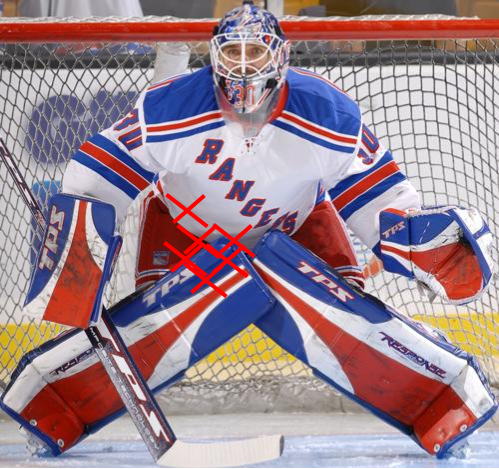

```{r, echo=FALSE, message=FALSE, warning=FALSE}
# Install these packages first
library(dplyr)
library(ggplot2)
library(tidyr)
library(knitr)

# Set seed for random number generator
set.seed(76)
```


## Accuracy vs Precision


## Analogy: Aiming for Top Right


## High Precision, Low Accuracy




## Low Precision, High Accuracy


## Sampling Dist'n of $\overline{X}$ for Normal Obs.

Let $\vec{X} = (X_1, \ldots, X_n)$ be IID Normal$(\mu=5, \sigma=2)$ RV.

Compare 1000 instances of $\overline{x}$ when 

* $n=100$. $SE = \frac{2}{\sqrt{100}} = 0.2$
* $n=1000$. $SE = \frac{2}{\sqrt{1000}} = 0.0632$

Let's pretend that we don't know that $\mu=5$ for sake of discussion, i.e. we 
are trying to estimate it.


## Sampling Dist'n of $\overline{X}$ for Normal Obs.

```{r, echo=FALSE}
par(mfrow=c(1,2))
xbar <- rep(0,1000)
for(i in 1:1000)
  xbar[i] <- mean(rnorm(n=100,mean=5,sd=2))
hist(xbar, xlab=expression(bar(x)), main="", xlim=c(4.25, 5.75))
title("n = 100")
abline(v=5,col="red",lwd=2)

xbar <- rep(0,1000)
for(i in 1:1000)
  xbar[i] <- mean(rnorm(n=1000,mean=5,sd=2))
hist(xbar, xlab=expression(bar(x)), main="", xlim=c(4.25, 5.75))
title("n = 1000")
abline(v=5,col="red",lwd=2)
```


## Sampling Dist'n of $\overline{X}$ for Normal Obs.

For the larger $n$

* the SE is smaller
* i.e. there is less varibility in the $\overline{x}$
* i.e. we have more precision
* i.e. our estimates $\overline{x}$ tend to be closer to the true population
mean $\mu=5$.


## Central Limit Theorem

```{r, echo=FALSE}
mu.1 <- 5
mu.2 <- 10
p.1 <- 0.7
p.2 <- 0.3
mu <- mu.1*p.1 + mu.2*p.2
x <- seq(2, 13, by=0.01)
y <- dnorm(x, mean=mu.1)*p.1 + dnorm(x, mean=mu.2)*p.2

# Sampling distribution values
n <- 15
x.bars <-
  replicate(10000,
            mean(rnorm(n, mean=sample(c(mu.1, mu.2), n, replace=TRUE, prob=c(p.1, p.2))))
            )
```

Say you have a wacky **population distribution** with $\mu$ in red:

```{r, echo=FALSE}
par(mfrow=c(1, 2))
# Population Distribution
plot(x, y, type='l', xlab="x: wing span (in feet)", ylab="",
     main="Population Dist'n")
abline(v=mu, col="red", lwd=2)
```


## Central Limit Theorem

Irregardless, the distribution of $\overline{x}$ will be normal if $n$ is large:

```{r, echo=FALSE}
par(mfrow=c(1, 2))
# Population Distribution
plot(x, y, type='l', xlab="x: wing span (in feet)", ylab="",
     main="Population Dist'n")
abline(v=mu, col="red", lwd=2)

# Sampling Distribution
hist(x.bars, xlim=range(x),
     xlab=expression(paste(bar(x), ": avg wing span (in feet)")),
     prob=TRUE, ylab="",
     main="Simulated Sampling Dist'n")
abline(v=mu, col="red", lwd=2)
```


## Wacky Example

Say you have another wacky population distribution $f(x)$

$$
f(x) = \left\{
  \begin{array}{ll}
    \exp(x)/2 & \mbox{for } x < 0 \\
    0 & \mbox{for } 0 \leq x < 7 \\ 
    \exp(7-x)/2 & \mbox{for } x \geq 7 \\
  \end{array}
\right.
$$


## Wacky Example

```{r, echo=FALSE}
n.plot.pts <- 10000
domain <- seq(from=-6, to=12, length=n.plot.pts)
pdf.values <- rep(0, length=n.plot.pts)

# PDF
f <- function(x) {
  if (x < 0) {
    y <- exp(x)/2
  }
  if (0 <= x & x < 7) {
    y <- 0
  }
  if (7 <= x) {
    y <- exp(7-x)/2
  }
  return(y)
}

# Inverse CDF
F.inv <- function(y) {
  if (y < 0.5) {
    x <- log(2*y)
  }
  if (y > 0.5) {
    x <- 7 - log(2*(1-y))
  }
  return(x)
}

# Function to simulate RV from f(x)
rgap <- function(n){
  y <- runif(n, min=0, max=1)
  output <- rep(0, n)
  for(i in 1:length(output)) {
    output[i] <- F.inv(y[i])
  }
  return(output)
}

# Plot PDF
for(i in 1:length(domain)) {
  pdf.values[i] <- f(domain[i])
}
plot(domain, pdf.values, type='l', xlab="x", ylab="density", main="PDF f(x)")

# Simulation characteristics.
n.sim <- 10000
n <- c(1, 2, 4, 6, 10, 25)
```


## Wacky Example

Now let's **simulate** the sampling distribution of $\overline{X}$ (using 10000
simulations) for different values of $n$: 1, 2, 4, 6, 10, and 25.


## Wacky Example

When $n=1$, simulating from the sampling dist'n is the same as simulating
from the population dist'n since $\overline{x} = x_1$

```{r, echo=FALSE, cache=TRUE}
j <- 1
x.bar.vector <- rep(0, n.sim)
for(i in 1:n.sim){
  sample <- rgap(n[j])
  x.bar.vector[i] <- mean(sample)
}
title <- paste("Sampling Dist'n of Xbar for n =", n[j])
hist(x.bar.vector, breaks=50, xlab=expression(bar(x)), prob=TRUE, main=title)
```


## Wacky Example

For $n=2$, 3 modes appear based on where $X_1, X_2$ come from:  1) both the left, 2) 
one left and one right, and 3) both from right.

```{r, echo=FALSE, cache=TRUE}
j <- 2
x.bar.vector <- rep(0, n.sim)
for(i in 1:n.sim){
  sample <- rgap(n[j])
  x.bar.vector[i] <- mean(sample)
}
title <- paste("Sampling Dist'n of Xbar for n =", n[j])
hist(x.bar.vector, breaks=50, xlab=expression(bar(x)), prob=TRUE, main=title)
```


## Wacky Example

```{r, echo=FALSE, cache=TRUE}
j <- 3
x.bar.vector <- rep(0, n.sim)
for(i in 1:n.sim){
  sample <- rgap(n[j])
  x.bar.vector[i] <- mean(sample)
}
title <- paste("Sampling Dist'n of Xbar for n =", n[j])
hist(x.bar.vector, breaks=50, xlab=expression(bar(x)), prob=TRUE, main=title)
```


## Wacky Example

```{r, echo=FALSE, cache=TRUE}
j <- 4
x.bar.vector <- rep(0, n.sim)
for(i in 1:n.sim){
  sample <- rgap(n[j])
  x.bar.vector[i] <- mean(sample)
}
title <- paste("Sampling Dist'n of Xbar for n =", n[j])
hist(x.bar.vector, breaks=50, xlab=expression(bar(x)), prob=TRUE, main=title)
```


## Wacky Example

```{r, echo=FALSE, cache=TRUE}
j <- 5
x.bar.vector <- rep(0, n.sim)
for(i in 1:n.sim){
  sample <- rgap(n[j])
  x.bar.vector[i] <- mean(sample)
}
title <- paste("Sampling Dist'n of Xbar for n =", n[j])
hist(x.bar.vector, breaks=50, xlab=expression(bar(x)), prob=TRUE, main=title)
```


## Wacky Example

By $n=25$ the approximation looks pretty good...

```{r, echo=FALSE, cache=TRUE}
j <- 6
x.bar.vector <- rep(0, n.sim)
for(i in 1:n.sim){
  sample <- rgap(n[j])
  x.bar.vector[i] <- mean(sample)
}
title <- paste("Sampling Dist'n of Xbar for n =", n[j])
hist(x.bar.vector, breaks=50, xlab=expression(bar(x)), prob=TRUE, main=title)
```


## Wacky Example

...as evidenced by a superimposed normal curve.

```{r, echo=FALSE, cache=TRUE}
hist(x.bar.vector, breaks=50, xlab=expression(bar(x)), prob=TRUE, main=title)
curve(dnorm(x, mean=mean(x.bar.vector), sd=sd(x.bar.vector)), add=TRUE, col="red", lwd=2)
```


