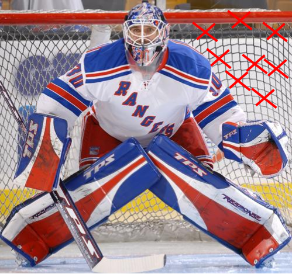

```{r, echo=FALSE, message=FALSE, warning=FALSE}
# Install these packages first
library(dplyr)
library(ggplot2)
library(tidyr)
library(knitr)

# Set seed for random number generator
set.seed(76)
```


## Accuracy vs Precision


## Analogy: Aiming for Top Right


## High Precision, Low Accuracy


## Low Precision, High Accuracy




## Sampling Dist'n of $\overline{X}$ for Normal Obs.

Let $\vec{X} = (X_1, \ldots, X_n)$ be IID Normal$(\mu=5, \sigma=2)$ RV.

Compare 1000 instances of $\overline{x}$ when 

* $n=100$. $SE = \frac{2}{\sqrt{100}} = 0.2$
* $n=1000$. $SE = \frac{2}{\sqrt{1000}} = 0.0632$

Let's pretend that we don't know that $\mu=5$ for sake of discussion, i.e. we 
are trying to estimate it.


## Sampling Dist'n of $\overline{X}$ for Normal Obs.

```{r, echo=FALSE}
par(mfrow=c(1,2))
xbar <- rep(0,1000)
for(i in 1:1000)
  xbar[i] <- mean(rnorm(n=100,mean=5,sd=2))
hist(xbar, xlab=expression(bar(x)), main="", xlim=c(4.25, 5.75))
title("n = 100")
abline(v=5,col="red",lwd=2)

xbar <- rep(0,1000)
for(i in 1:1000)
  xbar[i] <- mean(rnorm(n=1000,mean=5,sd=2))
hist(xbar, xlab=expression(bar(x)), main="", xlim=c(4.25, 5.75))
title("n = 1000")
abline(v=5,col="red",lwd=2)
```


## Sampling Dist'n of $\overline{X}$ for Normal Obs.

For the larger $n$

* the SE is smaller
* i.e. there is less varibility in the $\overline{x}$
* i.e. we have more precision
* i.e. our estimates $\overline{x}$ tend to be closer to the true population
mean $\mu=5$.


