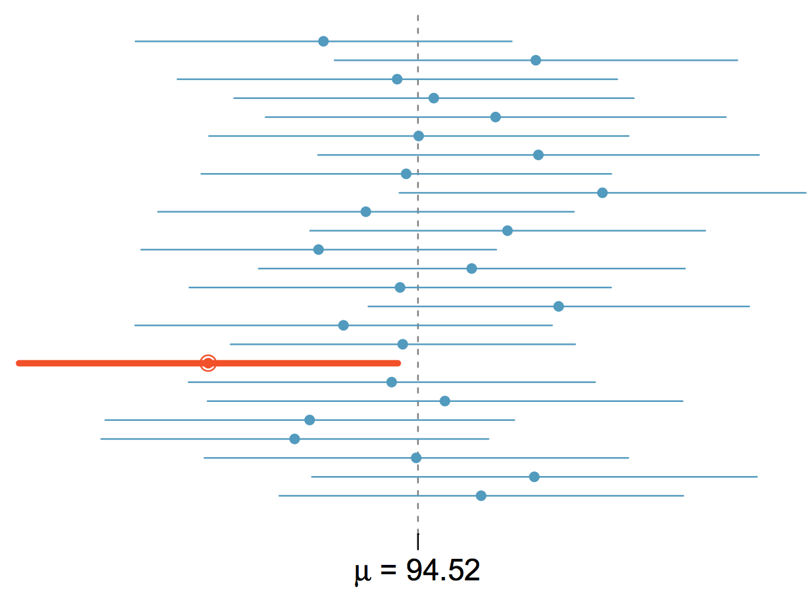

```{r, echo=FALSE, message=FALSE, warning=FALSE}
# Install these packages first
library(dplyr)
library(ggplot2)
library(tidyr)
library(knitr)
library(openintro)
library(gtools)

# Set seed for random number generator
set.seed(89)
data("run10")
```


## Conclusion of a Hypothesis Test

Why the hair-splitting between

* Failing to reject $H_0$
* ~~Accepting $H_0$~~


## Conclusion of a Hypothesis Test

Because 

* **absense of evidence is not evidence of absense**
* Example of the **black swan fallacy**:  just because you've never seen a black
swan, doesn't mean black swans don't exist.


## Example: Male vs Female Run Times

```{r, echo=FALSE, message=FALSE}
run10 <- run10 %>% 
  tbl_df() %>% 
  select(gender, time)
ggplot(data=run10, aes(x=time)) + 
  geom_histogram(aes(y=..density..)) + 
  facet_wrap(~gender, nrow=2) + 
  xlab("Time (minutes)") + 
  ggtitle("Cherry Blossom 10K Run Times")
```


## Population

```{r, echo=FALSE, eval=FALSE}
run10 %>% 
  group_by(gender) %>% 
  summarise(mean=round(mean(time),3), n=n()) %>% 
  kable()
```

We **know** $\mu_F - \mu_M \neq 0$

|gender |   mean|    n|
|:------|------:|----:|
|F      | $\mu_F = 99.0$| 9732|
|M      | $\mu_M = 88.4$| 7192|


## Hypothesis Test

We still conduct a hypothesis test at $\alpha=0.05$ 

$$
\begin{eqnarray*}
&& H_0: \mu_F - \mu_M = 0\\
\text{vs}&& H_A: \mu_F - \mu_M \neq 0\\
\end{eqnarray*}
$$

with a sample of 2 women and 3 men...


## The Sample

```{r, echo=FALSE, message=FALSE}
women <- run10 %>% 
  filter(gender=="F") %>% 
  top_n(-2)
men <- run10 %>% 
  filter(gender=="M") %>% 
  top_n(3)
sample <- 
  bind_rows(women, men) 
sample %>% 
  kable()

# Compute observed difference
times <- sample$time
index <- c(1,2)
observed <- mean(times[index]) - mean(times[-index])
```

$\text{}$

i.e. the observed difference $\overline{x}_F - \overline{x}_M$ = `r round(observed,1)`. 


## Null Distribution

```{r, echo=FALSE, message=FALSE}
indices <- combinations(5,2)
null_dist <- rep(0, nrow(indices))
for(i in 1:nrow(indices)){
  null_dist[i] <- mean(times[indices[i,]]) - mean(times[-indices[i,]])
}
```

An exhaustive two-sample permutation test yields a $p$-value of 0.2:

```{r, echo=FALSE, message=FALSE}
hist(null_dist, main="Null Distribution", xlab="Difference in Mean Time")
abline(v=observed, col="red", lwd=2)
```


## Conclusion

$p$-value = $0.2 > \alpha =0.05$

Conclusions:

* **We accept $H_0$**: men have the same mean running time as women. **NOT TRUE**
* **We fail to reject $H_0$**: nothing suggests they are not the same.

The latter is more conservative and correct.


## What I Facebook about

 


## Confidence Intervals

We want to infer about an unknown parameter $\theta$. Using just a point estimate
$\widehat{\theta}$ is akin to:


## Confidence Intervals

Whereas using a **confidence interval** is akin to:


## Interpretation

Say $\mu=94.52$ is the true population mean. Let each confidence interval be 
based on a different random sample $\vec{x}$ of size $n$.

 


