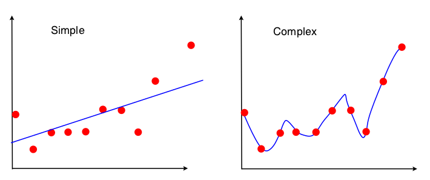

```{r, echo=FALSE, message=FALSE, warning=FALSE}
# Install these packages first
library(dplyr)
library(ggplot2)
library(tidyr)
library(knitr)
library(readr)

# Set seed for random number generator
set.seed(76)
```


## Simulate Two Estimators

```{r}
weights_1 <- c(1/3, 1/3, 1/3)
weights_2 <- c(1/1000, 998/1000, 1/1000)

N <- 10^4
sample_mean_1 <- rep(0, N)
sample_mean_2 <- rep(0, N)

for(i in 1:N){
  # sample 3 IID normal obs.
  x <- rnorm(n=3, mean=0, sd=1)
  
  # compute both sample means
  sample_mean_1[i] <- sum(x*weights_1)
  sample_mean_2[i] <- sum(x*weights_2)
}
```


## Sampling Distributions

```{r, echo=FALSE}
sample_means <- data.frame(
  Estimator = factor(c(rep(1, N), rep(2, N))),
  sample_means = c(sample_mean_1, sample_mean_2)
) %>% tbl_df()

ggplot(data=sample_means, 
       aes(x=sample_means, y=..density.., fill=Estimator)) +
  geom_histogram(bins=50) +
  facet_wrap(~Estimator, ncol=2) +
  xlab("sample mean") +
  ggtitle("Sampling Distributions of Two Estimators of Mean")
```


## What is Machine Learning?

Machine learning is the science of getting computers to act without being explicitly programmed.


## What is Machine Learning?


## Bias/Variance Trade-Off




## Consistency

```{r, echo=FALSE}
n_vector <- 10^c(1:4)
N <- 500
sample_means_overall <- NULL

for(n in n_vector){
  sample_means <- rep(0, N)
  for(i in 1:N){
    x <- rnorm(n)
    sample_means[i] <- mean(x)
  }
  sample_means_overall <- sample_means_overall %>% 
    bind_rows(
      data_frame(
        n=rep(n, N),
        xbar=sample_means
      )
    )
}

eps <- 0.1
ggplot(data=sample_means_overall, aes(x=n, y=xbar)) +
  geom_point() +
  scale_x_log10(breaks = 10^c(1:4)) + 
  geom_hline(yintercept = c(0-eps, 0+eps), linetype="dashed") +
  xlab("n (log-scale)") +
  ylab("sample means") +
  ggtitle("Consistency")
```


