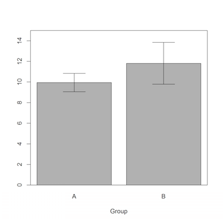

```{r, echo=FALSE, message=FALSE, warning=FALSE}
# Install these packages first
library(dplyr)
library(ggplot2)
library(tidyr)
library(knitr)
library(readr)

# Set seed for random number generator
set.seed(76)
```


## Accurate Degrees of Freedom
Welch's Degrees of Freedom
$$
\nu = \frac{
\left(
\frac{s_1^2}{n_1} + \frac{s_2^2}{n_2}
\right)^2
}{
\frac{\left(\frac{s_1^2}{n_1}\right)^2}{n_1-1} + \frac{\left(\frac{s_2^2}{n_2}\right)^2}{n_2-1}
}
$$


## Comparing Two Means

Say you are interested in the difference of means $\mu_1 - \mu_2$

Group | n  | $\overline{x}$ | $s$
------ | ------------- | -------------
1 | $n_1=32$ | $\overline{x}_1=83.0$ | $s_1=81.10082$
2| $n_2=35$ | $\overline{x}_2=40.6$ | $s_2=94.47617$ 


## Comparing Two Means

A 95\% confidence interval for $\mu_1$ is 
$$
\overline{x}_1 \pm 1.96 \frac{s_1}{\sqrt{n_1}} = [54.9, 111.1]
$$
while a 95\% confidence interval for $\mu_2$ is 
$$
\overline{x}_2 \pm 1.96 \frac{s_2}{\sqrt{n_2}} = [9.3, 71.9]
$$

i.e. These confidence intervals do overlap, suggesting **no difference**.


## Comparing Two Means

A 95\% confidence interval for $\mu_1-\mu_2$ is 
\[
(\overline{x}_1- \overline{x}_2) \pm 1.96 \sqrt{\frac{s_1^2}{n_1}+\frac{s_2^2}{n_2}} = [0.337, 84.463]
\]

i.e. It does not include 0, suggesting **a difference**!


## Dynamite Plots

Issue: Dynamite plots are often used to compare means and their confidence intervals. Are A and B significantly different?




## PDF of Y_max

```{r, echo=FALSE}
n <- 5
curve(n*x^(n-1), from=0, to=1, n=1000, xlab="y_max", ylab="density")
```


## PDF of Y_max

```{r, echo=FALSE}
n <- 5
alpha <- 0.05
q1 <- (alpha/2)^(1/n)
q2 <- (1-alpha/2)^(1/n)
curve(n*x^(n-1), from=0, to=1, n=1000, xlab="y_max", ylab="density")
abline(v=c(q1, q2), lwd=2, lty=2, col=c("black", "red"))
legend("topleft", legend=c("q1", "q2"), lty=2, col=c("black", "red"), lwd=2, bty="n")
```


