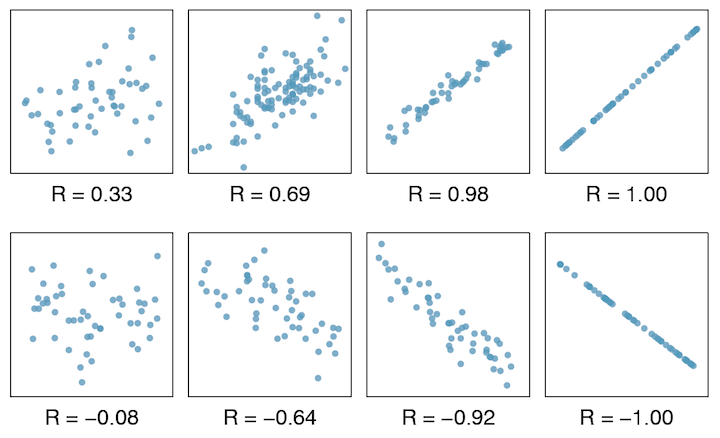

```{r, echo=FALSE, message=FALSE, warning=FALSE}
# Install these packages first
library(dplyr)
library(ggplot2)
library(tidyr)
library(knitr)
library(readr)
library(mvtnorm)

# Set seed for random number generator
set.seed(76)
```

```{r, echo=FALSE, eval=FALSE}
mu <- c(0, 0)
sigma <- matrix(c(1, 0, 0, 1), nrow=2)
X <- rmvnorm(100, mean = mu, sigma = sigma)
plot(X[,1], X[,2], xlab="x", ylab="y", pch=19)
cov(x, y)
```


## Last Time

We saw the Likelihood Ratio Test for simple vs simple hypotheses:

$$
\begin{align}
& H_0: \theta = \theta_0\\
\text{vs} & H_A: \theta = \theta_A
\end{align}
$$

This scenario has limited applicability however.


## Last Time

Neyman-Pearson Lemma says the test with rejection rule

> Reject $H_0$ when $T(\vec{x}) = \frac{L(\theta_0|\vec{x})}{L(\theta_A|\vec{x})} < c$

where $c$ is chosen so that the test has significance level (AKA type I error
rate) $\alpha$

**has highest power of all tests with significance level $\leq
\alpha$.**


## Variance-Covariance

```{r}
x <- c(-1, 0, 0, 1)
y <- c(0, 1, -1, 0)
cov(x, y)
```

```{r, echo=FALSE, fig.height=4, fig.width=4}
plot(x, y, pch=19, asp=1)
abline(v=0, lty=2, lwd=0.5)
abline(h=0, lty=2, lwd=0.5)
```


## Correlation Coefficient




## Correlation Coefficient

Example: height vs weight.


## Correlation Coefficient

What does "best fitting line" mean?


## Correlation Coefficient

Consider ANY point $(x_i, y_i)$ for $i=1,\ldots,50$. 


## Correlation Coefficient

Now consider this point's deviation from the **regression line**.


## Correlation Coefficient

Do this for another point $x_i$...


## Correlation Coefficient

Do this for another point $x_i$...


## Correlation Coefficient

Regression minimizes the sum of the **squared** arrow lengths.  


