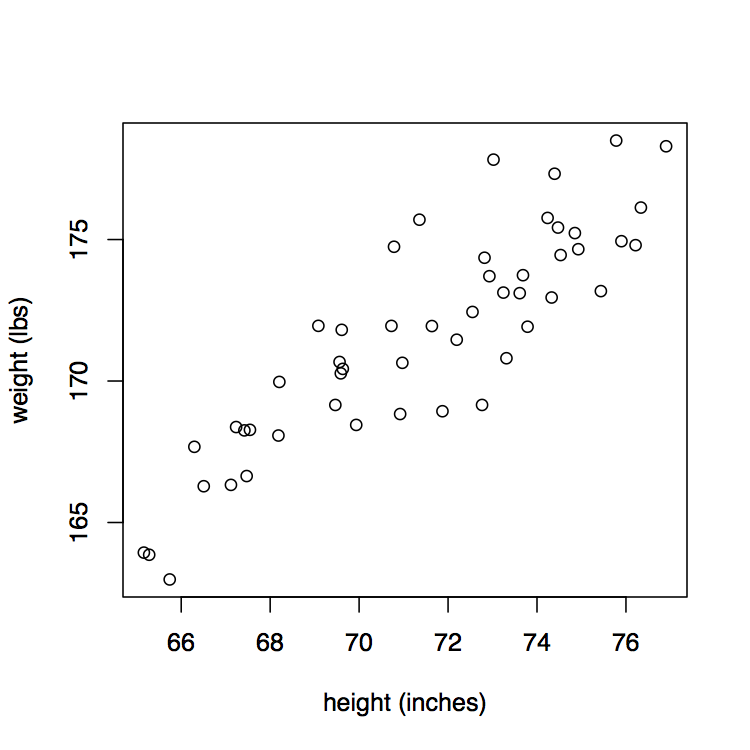
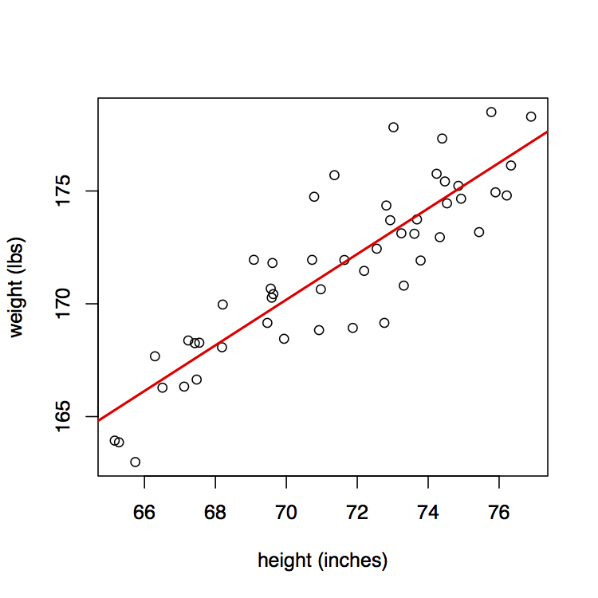
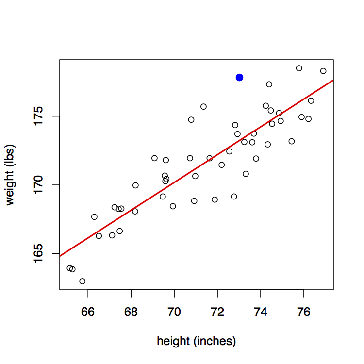
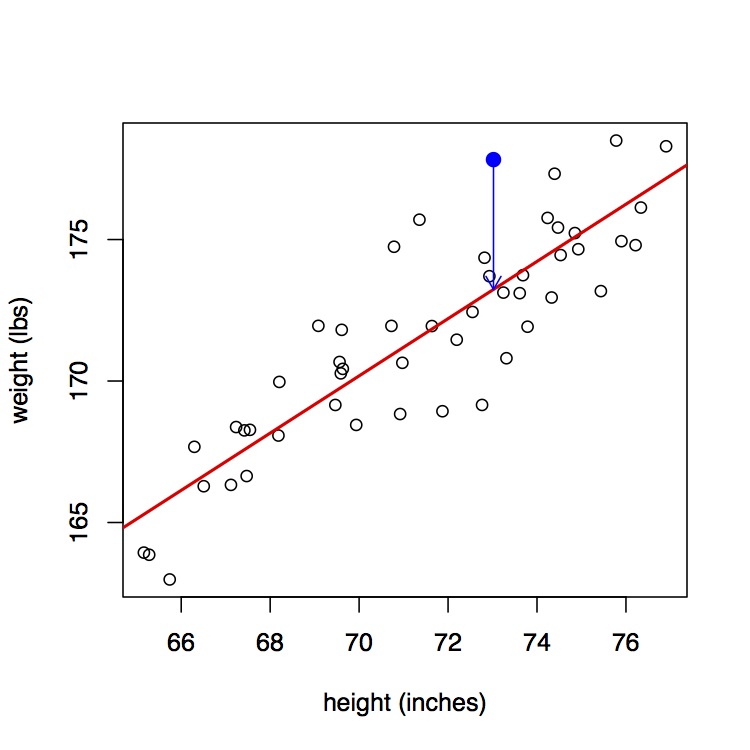
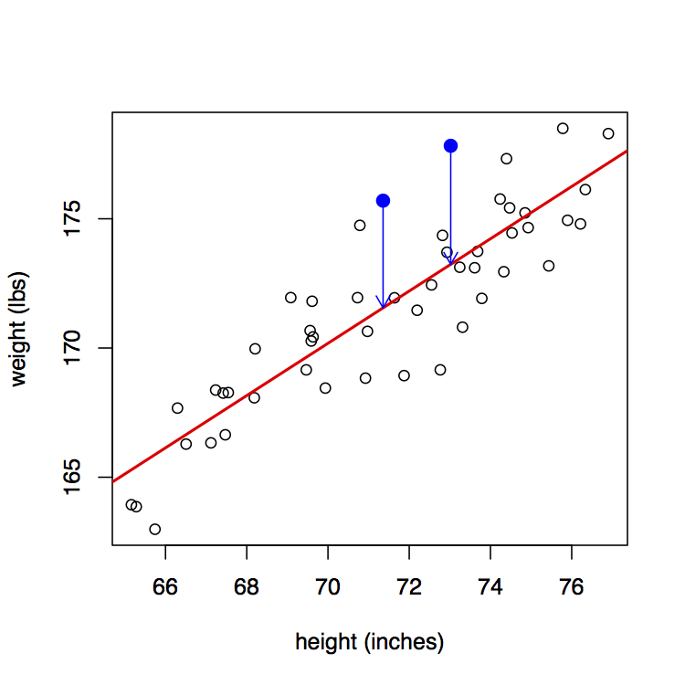
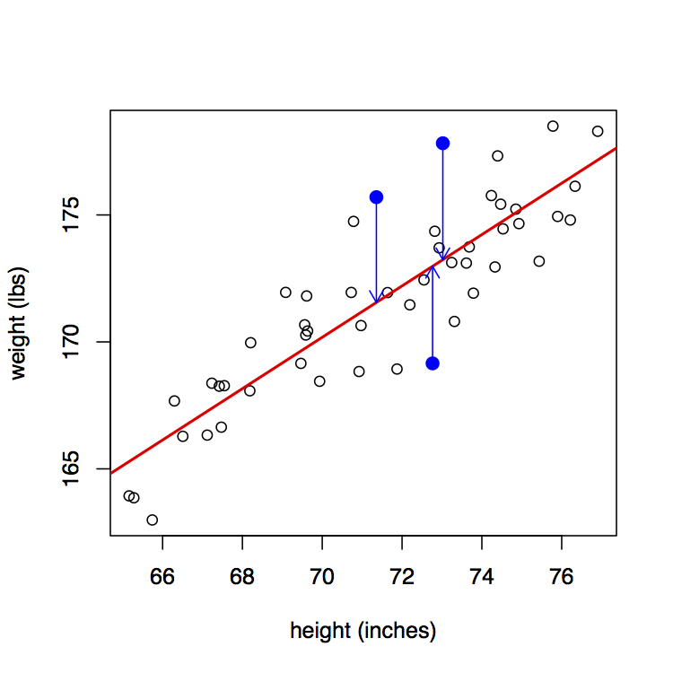
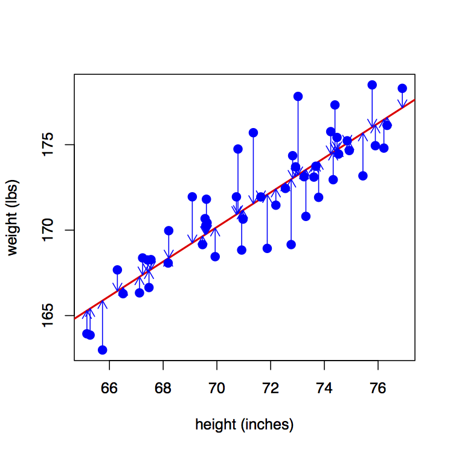

```{r, echo=FALSE, message=FALSE, warning=FALSE}
# Install these packages first
library(dplyr)
library(ggplot2)
library(tidyr)
library(knitr)
library(readr)

# Set seed for random number generator
set.seed(76)
```


## Simple Linear Regression

Example: height vs weight.




## Simple Linear Regression

What does "best fitting line" mean?




## Simple Linear Regression

Consider ANY point $(x_i, y_i)$ for $i=1,\ldots,50$. 




## Simple Linear Regression

Now consider this point's deviation from the **regression line**.




## Simple Linear Regression

Do this for another point $x_i$...




## Simple Linear Regression

Do this for another point $x_i$...




## Simple Linear Regression

Regression minimizes the sum of the **squared** arrow lengths.  




## Original Data Example

Naive model:

```{r, echo=FALSE, message=FALSE}
library(resampledata)
library(ggplot2)
library(dplyr)
data("Spruce")
Spruce <- Spruce %>% 
  tbl_df()

# Original model
model <- lm(Di.change~Ht.change, data=Spruce)
Spruce$residuals <- residuals(model)

# Lame model
Spruce$y2 <- coefficients(model)[1] + coefficients(model)[2]*Spruce$Ht.change
model2 <- lm(y2~Ht.change, data=Spruce)
Spruce$residuals2 <- residuals(model2)

p1 <- ggplot(data=Spruce, aes(x=min(Ht.change), y=Di.change)) +
  ylab("Diameter Change") + 
  geom_point() + 
  xlim(range(Spruce$Ht.change)) + 
  theme(axis.line=element_blank(),
      axis.text.x=element_blank(),
      axis.ticks=element_blank(),
      axis.title.x=element_blank())
p1
```


## Original Data Example

What's the best fitting value for $y_i$?  $\overline{y}$ 

```{r, echo=FALSE}
p1 + 
  geom_hline(yintercept = mean(Spruce$Di.change), col="blue", size=1)
```

## Original Data Example

Now say instead of the naive model:

```{r, echo=FALSE}
p2 <- ggplot(data=Spruce, aes(x=min(Ht.change), y=Di.change)) +
  ylab("Diameter Change") + 
  geom_point() + 
  xlim(range(Spruce$Ht.change)) + 
  xlab("Height Change")
p2
```


## Original Data Example

We use information contained in predictor variable $x$.

```{r, echo=FALSE}
p3 <- ggplot(data=Spruce, aes(x=Ht.change, y=Di.change)) +
  ylab("Diameter Change") + 
  geom_point() + 
  xlim(range(Spruce$Ht.change)) + 
  xlab("Height Change")
p3
```

## Original Data Example

Now the best fitting value for $y_i$ is $\widehat{y}_i = a + bx_i$

```{r, echo=FALSE}
p3 +
  stat_smooth(method="lm", se=FALSE)
```


## Original Data Example

Let's flatten out the blue curve to focus on the **residuals**, i.e. what's
leftover.

```{r, echo=FALSE}
p4 <- ggplot(data=Spruce, aes(x=Ht.change, y=residuals)) +
  ylab("Residuals") + 
  geom_point() + 
  xlim(range(Spruce$Ht.change)) + 
  xlab("Height Change") +
  geom_hline(yintercept = 0, col="blue", size=1)

p4
```


## Fake Data Example

Say say instead the relationship between $x$ and $y$ is:

```{r, echo=FALSE}
p5 <- ggplot(data=Spruce, aes(x=Ht.change, y=y2)) +
  ylab("Diameter Change") + 
  geom_point() + 
  xlim(range(Spruce$Ht.change)) + 
  xlab("Height Change")
p5
```

## Example

The regression line is a perfect fit.

```{r, echo=FALSE}
p5 +
  stat_smooth(method="lm", se=FALSE)
```

## Example

All residuals are = 0.

```{r, echo=FALSE}
p6 <- ggplot(data=Spruce, aes(x=Ht.change, y=residuals2)) +
  ylab("Diameter Change") + 
  geom_point() + 
  xlim(range(Spruce$Ht.change)) + 
  xlab("Height Change") +
  ylim(range(Spruce$residuals))+
  stat_smooth(method="lm", se=FALSE)

p6 
```


