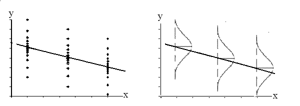
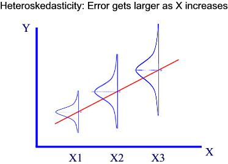
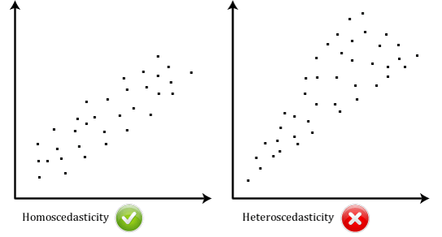

```{r, echo=FALSE, message=FALSE, warning=FALSE}
# Install these packages first
library(dplyr)
library(ggplot2)
library(tidyr)
library(knitr)
library(readr)

# Set seed for random number generator
set.seed(76)

# Load data and run regression
library(resampledata)
library(ggplot2)
library(dplyr)
data("Spruce")
Spruce <- Spruce %>% 
  tbl_df()

# Original model
model <- lm(Di.change~Ht.change, data=Spruce)
Spruce$residuals <- residuals(model)
```


## Spruce Tree Data Set

Recall from Lec26, we modeled:

```{r, echo=FALSE}
p3 <- ggplot(data=Spruce, aes(x=Ht.change, y=Di.change)) +
  geom_point() + 
  xlim(range(Spruce$Ht.change)) + 
  xlab(expression(paste(x[i], " : Height Change"))) +
  ylab(expression(paste(y[i], " : Diameter Change")))
p3
```


## Least Squares Line

The best fitting value for $y_i$ is $\widehat{y}_i = a + bx_i$

```{r, echo=FALSE}
p3 +
  stat_smooth(method="lm", se=FALSE)
```


## Residuals Plot

We plot the **residuals** vs $x_i$ i.e $y_i - \widehat{y}_i$

```{r, echo=FALSE}
p4 <- ggplot(data=Spruce, aes(x=Ht.change, y=residuals)) +
  geom_point() + 
  xlim(range(Spruce$Ht.change)) + 
  geom_hline(yintercept = 0, col="blue", size=1) + 
  xlab(expression(paste(x[i], " : Height Change"))) +
  ylab(expression(paste(y[i] - hat(y[i]), " : Residual")))
p4
```


## Residuals Plot




## Residuals Plot





## Residuals Plot

```{r}
set.seed(76)
data(Skating2010)
p <- ggplot(data=Skating2010, aes(x=Short, y=Free)) + 
  geom_point(col="red")
p + stat_smooth(method="lm", se=FALSE, col="black")

bootstrap_coeff <- data_frame(intercept=rep(0, 30), slope=rep(0, 30))
n <- nrow(Skating2010)
for(i in 1:30){
  bootstrap <- Skating2010[sample(1:n, n, replace=TRUE), ]
  coeff <- coefficients(lm(Free~Short, data=bootstrap))
  p <- p + 
    geom_abline(intercept = coeff[1], slope = coeff[2])
}
p + geom_point(col="red")
  
```


