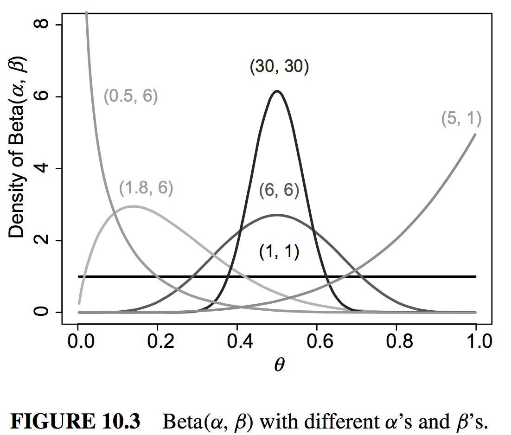

```{r, echo=FALSE, message=FALSE, warning=FALSE}
# Install these packages first
library(dplyr)
library(ggplot2)
library(tidyr)
library(knitr)
library(readr)
```

```{r, echo=FALSE, message=FALSE, warning=FALSE}
#param1 <- 100
param2 <- 4
obs <- 16
n <- 20
#obs2 <- 80
#n2 <- 100
```


## Publication Bias

* [Xkcd comic](https://xkcd.com/882/)
* Publication bias c/o [HBO](https://youtu.be/0Rnq1NpHdmw?t=2m23s)
* [Journal](http://jnrbm.biomedcentral.com/articles/10.1186/s12952-015-0038-4)


## Recall

Prior + Likelihood = Posterior

```{r, echo=FALSE, message=FALSE, warning=FALSE, fig.height=3}
par(mfrow=c(1,3))
curve(dbeta(x, shape1 = param2, shape2 = param2), from=0, to=1, n=5000,
      xlab="p", ylab="density", main="Prior Distribution", col="red")
abline(v=0.5, lty=2, col="red")
curve(dbinom(x = obs, size = n, prob = x), from=0, to=1, n=5000,
      xlab="p", ylab="Likelihood L(p|x)", main="Likelihood")
abline(v=obs/n, lty=2)
curve(dbeta(x, shape1 = param2+obs, shape2 = param2+n-obs), from=0, to=1, n=5000,
      xlab="p", ylab="density", main="Posterior Distribution", col="red")
abline(v=(param2+obs)/(param2+param2+n), lty=2, col="red")
```

> - Now let's put both on the same plot:


## On the Same Plot

Mean of the posterior (in red) is a weighted average of prior mean (in black)
and likelihood function (centered at MLE)

```{r, echo=FALSE, message=FALSE, warning=FALSE, fig.height=5, fig.width=5}
curve(dbeta(x, shape1 = param2+obs, shape2 = param2+n-obs), from=0, to=1, 
      n=5000, xlab="p", ylab="density", main="", col="red")
# abline(v=(param2+obs)/(param2+param2+n), lty=2, col="red")
abline(v=obs/n, lty=2)
curve(dbeta(x, shape1 = param2, shape2 = param2), n=5000, add=TRUE)
# abline(v=0.5, lty=2)
legend("topleft", legend=c("Prior Dist'n", "Posterior Dist'n", "MLE"), 
       lty=c(1, 1, 2), col=c("black", "red", "black"), bty="n")
```


## Focus on Posterior Distribution

The prob density function $\pi(\theta|\vec{x})$:

```{r, echo=FALSE, message=FALSE, warning=FALSE, fig.height=5, fig.width=5}
curve(dbeta(x, shape1 = param2+obs, shape2 = param2+n-obs), from=0, to=1, 
      n=5000, xlab="p", ylab="density", main="Posterior Distribution", col="red")
abline(v=qbeta(c(0.025, 0.975), shape1 = param2+obs, shape2 = param2+n-obs), lty=2)
legend("topleft", legend=c("2.5 & 97.5 %'iles"), lty=2, col="black", bty="n")
```


## Different Prior Choices

Setting different values of $(\alpha, \beta)$ allows for different choices of prior
distribution $\pi(p)$. From page 310:




## Conjugate Priors

The following [table](https://en.wikipedia.org/wiki/Conjugate_prior#Table_of_conjugate_distributions) 
shows many known 

* prior
* likelihood (data)

conjugate relationships.


## Most Famous Baseball Statistic

$$
\text{Batting Avg} = \frac{\text{# of Hits}}{\text{# of At Bats}}
$$

which is a form of proportion $p$ with

* $\text{# of Hits}$: # of [successes](https://www.youtube.com/watch?v=ilWab_vyB4g)
* $\text{# of At Bats}$: $n$


